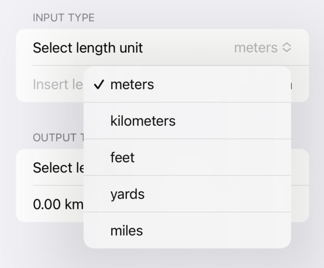
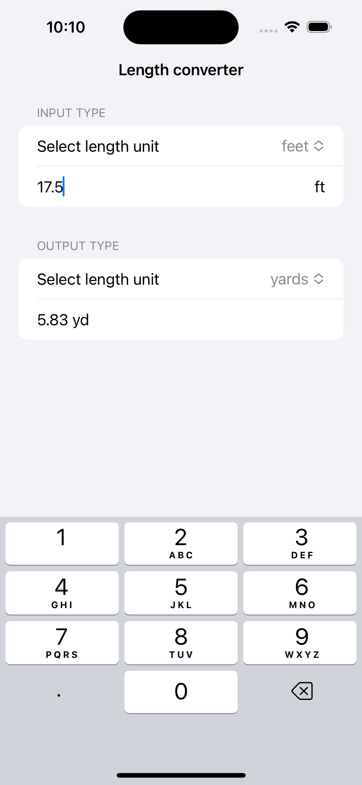
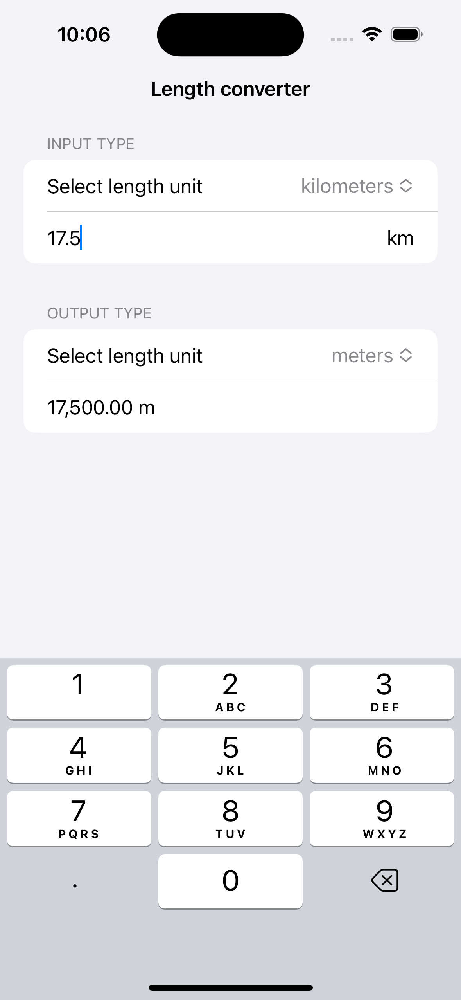
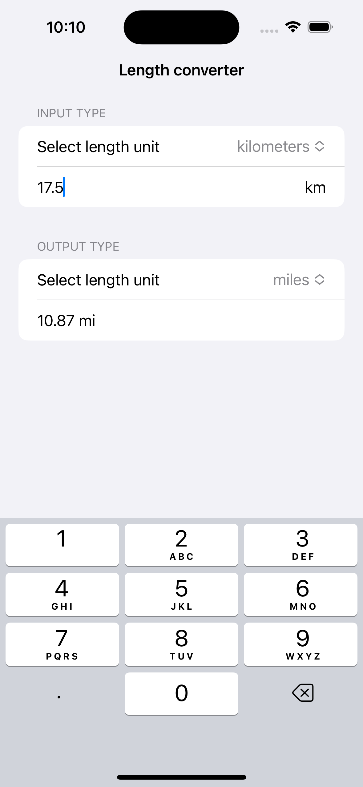

#  Convertitore

## What is Convertitore? 
"Convertitore" is an iOS converter app that allows you to convert the principal measurement lengths.

Theese are the mesurament avaiable
- Meters;
- Kilometers;
- Feet;
- Miles;
- Yard;

Here some example:

